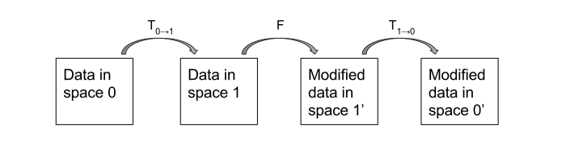
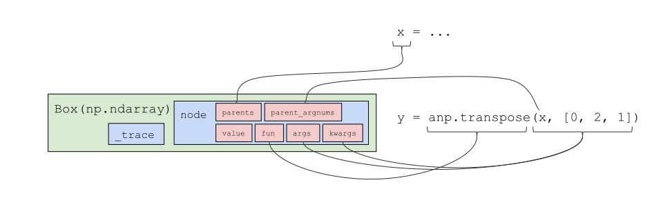
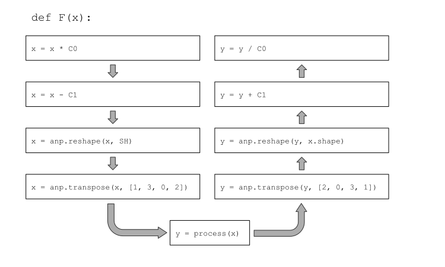
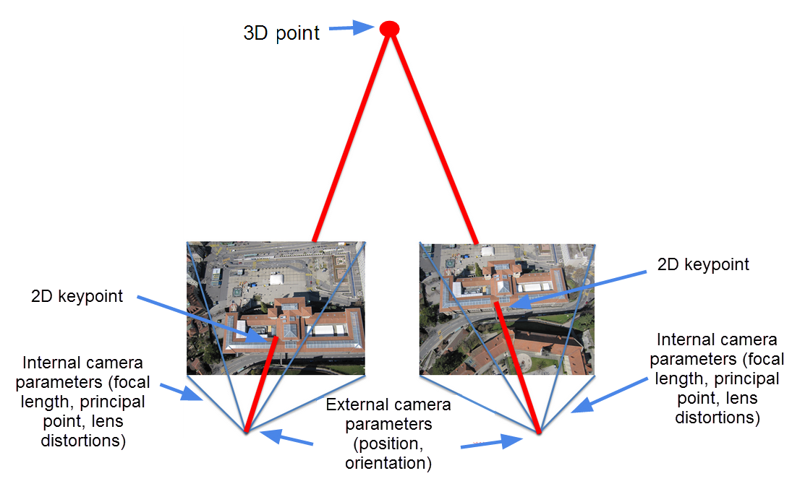

# AutoInv
Ben Mildenhall, Fall 2017

## Summary
AutoInv can automatically invert (a subset of) functions written in native Python and Numpy.

## Background
Consider the following program structure, which is a common occurence in code for manipulating arrays in image processing and scientific computing:



The T operators typically consist of array arithmetic and reshaping operations, and F is some sort of processing function. There are prime marks on the 1 and 0 in the last two boxes since T0->1 and T1->0 do not have to be perfect inverses - T1->0 could be the inverse of a differently parametrized version of T0->1.

Examples:

* T0->1 takes an `[H, W]` image array to a `[H/K, W/K, K^2]` array by reshaping each `K x K` block of the image into a third channel. F decimates to a single `[H/K, W/K]` image, then uses a superresolution technique to recover all `K^2` elements of the final channel. T1->0 reshapes from `[H/K, W/K, K^2]` back to `[H, W]`.
* T0->1 maps from pixel space for camera A to world space. F processes points in 3D (could be a no-op). T1->0 maps from world space to pixel space for camera B. Here, T0->1 and T1->0 are not perfect inverses, but T10 is still made up of a reversed list of the primitive functions used in T01, just with different parameters.

It is tedious and bug-prone to write out T1->0 automatically when it can be inferred from T0->1. The goal of this project is to provide a proof of concept for using an Autograd-like tracing system to do exactly this.


## Approach

### Recording the execution trace

AutoInv uses a simplified version of the Autograd model for recording the execution traces of functions.

Every use of the `np.ndarray` type is wrapped by a `Box` subclass, whose only additional members are `node` and `_trace` fields. The `Node` class is used to record the trace of a single wrapped Numpy function call, including fields 

* `fun`: the function being called,
* `args`, `kwargs`: the args and kwargs provided,
* `value`: the value returned by the function,
* `parent_argnums`: argnums corresponding to the boxed arguments, and
* `parents`: a list of pointers to the `node` fields of all such boxed args.

After executing a block of Python code that uses AutoInv's wrapped version of Numpy, the `parents` list for each boxed Numpy array will trace out the complete execution DAG. 



This is a simplified version of the function wrapper we apply to the Numpy library:

```python
def primitive(f_raw):

    def f_wrapped(*args, **kwargs):
        value = f_raw(*_args, **kwargs)

        # boxes is a list of pairs (argnum, boxed_arg)
        # with one entry for every boxed argument in args
        boxes, trace = find_top_boxed_args(args)
        parent_argnums = [a for a, _ in boxes]
        parents = [b.node for _, b in boxes]

        # box the output and record a Node 
        # if value is a numpy array
        if isinstance(value, _np.ndarray):
            # view() allows you to treat a numpy
            # array as any of its subclasses
            value = value.view(Box)
            value.node = Node(value, f_wrapped, args, kwargs, parent_argnums, parents)
            value._trace = trace
            
        return value
        
    return f_wrapped
```

The `_trace` field is used to keep track of which boxed arguments are "active" in the current trace: currently, AutoInv supports inversion for Python functions of a single Numpy array argument. Extraneous Numpy arrays that are used in computation but are not descendants of the function argument should not be traced for inversion. As in Autograd, this is implemented by seeding the function argument's `_trace` with an integer from a simple Python generator that returns _n_ the _n_-th time it is called. So every time we start a new trace, we know that `find_top_boxed_args` should only look for the boxed args with the largest `_trace` value. Basic tracing code:

```python
def trace(fun, x):
    with trace_stack.new_trace() as t:
        print 'New trace with value {}'.format(t)
        x.node = anp.Node(None, None, None, None, [], [])
    	x._trace = t
        end_box = fun(x)
        if isinstance(end_box, anp.Box) and end_box._trace == t:
            print 'Trace successful'
            return end_box
        else:
            warnings.warn("Output seems independent of input.")
            return end_box, None
        
```


### Function inversion

After getting the function trace, we make a backwards pass over the stored DAG to create the inverse function (without necessarily calling it yet). We'd like to automatically replicate something like this:



We do this by hand-writing an inverse generator for each primitive function in the Numpy library we'd like to be able to invert. These generators are stored in a dictionary `primitive_invs ` where the keys are function pointers. Thus the process to look up a function and generate its inverse when given a `node` works as follows:

1. Look up `inv_gen_argnum = primitive_invs[node.fun]`
2. Evaluate `inv_gen = inv_gen_argnum(argnum)` for `argnum = node.parent_argnums[0]`.
3. Evaluate `inv_fn = inv_gen(node.value, *node.args, **node.kwargs)`.
4. Return `inv_fn`, which will be passed `y` when the node inverse must be evaluated.

The outer wrapper with the `argnum` parameter allows us to use a different inverse generator depending on which function argument was boxed. _Note_: AutoInv currently only supports function inversion when a single argument is active in the trace, e.g., the inverse of `x0 + x1` where `x0` and `x1` have the same `_trace` value cannot be calculated.

The `inv_gen` function in the third step takes the function output and all inputs and uses it to generate an inverse for that Numpy function given those values in the trace. For example, for `roll`, the inverse generator is 

```python
lambda ans, x, shift, axis=None  : lambda g: anp.roll(g, -shift, axis=axis))
```

The generator here uses the `shift` and `axis` values from `args` to instantiate an inverse that can reverse that particular call to `roll`. Once evaluated, the inner lambda can be stored in the node to be later run (perhaps many times) when the inverse function is actually called.

For a binary function like `subtract`, we need an inverse for both `argnum=0` and `argnum=1`, so we use something like this:

```python
def subtract_inv_gen_argnum(argnum):
    assert argnum < 2
    if argnum==0:
        return lambda ans, x, y : lambda g : g + y
    else:
        return lambda ans, x, y : lambda g : g + y
```

We can also invert more complicated functions, such as `matmul`, by taking advantage of Numpy's linear algebra capabilities:

```python
lambda ans, A, B: lambda g : np.linalg.solve(A, g)
```

After generating the inverse function for each `node` in our execution trace, we can run the whole inverse by passing an input array through the each `node` inverse in backwards order. (See function `backward_pass` in `core.py`.)

_Note_: in order to create an inverse, we need an actual Numpy array with the correct shape to pass through the function, since the size of the input array can affect the inverses of individual `node` objects along the trace. Autograd does not need this since the gradient of a function takes inputs in the same "space" as the original function, whereas our inverse functions take inputs with the shape of the function's output.


## Example applications

Visit the Jupyter notebook file `AutoinvExamples.ipynb` to see working code for all of these examples.

### HDR+ merge: inverting array reshaping

The HDR+ algorithm jointly denoises a burst of `B` images. In order to provide robustness, it merges the images together one small tile at a time. These tiles overlap by 50% in each dimension, so every pixel is actually contained in 4 different merged tiles. A smooth windowing function is used to interpolate between the 4 tiles.

A simple first use case for AutoInv is inverting the code that patches up an image into `NxN` pixel tiles with a potential `N//2` pixel offset in each dimension:

```python
def hdrplus_tiled(noisy, c, sig, N):
    sh = noisy.shape[0:2]
    buffer = np.zeros_like(noisy[...,0])
    
    for i in range(2):
        for j in range(2):
    
            def patchify(noisy):
                # Apply offset
                patches = anp.roll(noisy, shift=anp.array([-N//2*i, -N//2*j]), axis=(0,1))
                # Reshape to isolate NxN tiles
                sh_ = [sh[0]//N, N, sh[1]//N, N] + list(patches.shape[2:])
                patches = anp.reshape(patches, sh_)
                patches = anp.swapaxes(patches, 2, 1)
                return patches
                
            depatchify = core.make_inverse(patchify, noisy[...,0])
            
            patches = patchify(noisy)
            merged_patches = hdrplus_merge(patches, c, sig)      
            merged = depatchify(merged_patches) 
            
            buffer += merged
            
    return buffer
```
Here `hdrplus_merge` applies the interpolation window and removes the final axis of length `B` corresponding to the image stack in the course of merging each stack of `NxN` pixel tiles. 

Something interesting here -- the `patchify` function is written so that it operates on the first two dimensions of the input while leaving the rest alone. This allows us to apply it as the forward operator for the full image stack `noisy` and the inverse operator for `merged_patches`, which lacks the final axis of size `B`. This is specified to AutoInv by passing `noisy[...,0]`, which has our final desired output size, as an example input for `make_inverse`.


### FFT: inverting through `matmul`

Here's a completely invertible implementation of the FFT "butterfly" algorithm that recurses on the even and odd halves of the input array as follows:


[img credit](https://en.wikipedia.org/wiki/Cooley%E2%80%93Tukey_FFT_algorithm)


```
def twiddle(x):
    # Define the twiddle factors matrix
    N = x.shape[-1] + 0.
    omega = anp.exp(-2.j * anp.pi / (2*N) * anp.arange(0, N))
    a0 = anp.stack([anp.ones_like(omega),  omega], axis=-1)
    a1 = anp.stack([anp.ones_like(omega), -omega], axis=-1)
    a = anp.stack([a0, a1], axis=-2)

    # Merge 'even' and 'odd' halves with twiddle matrix
    x = anp.swapaxes(x, -1, -2)
    x = anp.expand_dims(x, -1)
    x = anp.matmul(a, x)
    x = anp.swapaxes(x, -2, -3)
    x = anp.reshape(x, list(x.shape[:-3]) + [-1])
    return x

# Cooley-Tukey 1D FFT over the last axis of x
def my_fft(x):
    if x.shape[-1] >= 2:
        # Separate 'even' and 'odd' halves of last axis
        x = anp.reshape(x, list(x.shape[:-1]) + [x.shape[-1]//2, 2])
        x = anp.swapaxes(x, -1, -2)
        # Recursively apply FFT to each half
        x = my_fft(x)
        # Use twiddle to merge the halves
        x = twiddle(x)
    return x

# 2D FFT on final two axes as two applications of 1D FFT
def my_fft2(x):
    x1 = my_fft(x)
    x2 = my_fft(anp.swapaxes(x1, -1, -2))
    x2 = anp.swapaxes(x2, -1, -2)
    return x2

M = 64
my_fft2_inv = core.make_inverse(my_fft2, anp.zeros([M,M]))
# my_fft2_inv is now an inverse for the 64x64 2D FFT
```

All the Numpy functions used above are invertible. In particular, `matmul` is invertible because each 2x2 twiddle factor matrix is nonsingular. 

When tracing through the `my_fft` function, the recursive calls (and in fact, all function calls) are completely unrolled/inlined: as with Autograd, no control flow logic makes it into the trace. So the automatically generated inverse _only_ works when applied to correctly sized inputs.


### Camera projection: inverting with user-defined primitives
We can use AutoInv to invert a pixel space to world space reprojection function.



[img credit](https://support.pix4d.com/hc/article_attachments/115013086546/computation_3d_point1.png)

```python
def rodrigues(r):
    theta = np.linalg.norm(r)
    k = r / theta
    K = np.array([[0, -k[2], k[1]], [k[2], 0, -k[0]], [-k[2], k[0], 0.]])
    R = np.eye(3) + np.sin(theta) * K + (1. - np.cos(theta)) * np.dot(K, K)
    return R

# pts.shape is [..., 2]
def pix2cam(ppoint, f):
    def fun(pts):
	    pts = pts - ppoint
	    pts = pts / f
	    pts = anp.concatenate([pts, -anp.ones(list(pts.shape[:-1]) + [1])], axis=-1)
	    return pts
	return fun

# pts.shape is [..., 3]
def cam2world(rvec, tvec):
    R = rodrigues(rvec)
    def fun(pts):
	    pts = anp.expand_dims(pts, -1)
	    pts = anp.matmul(R, pts)
	    pts = anp.squeeze(pts, -1)
	    pts = pts + tvec
	    return pts
	return fun

def reproject_pts(depths):
    def fun(pts):
        return pts * depths
    return fun

@primitive 
def project_pts(pts):
    return pts / anp.expand_dims(-pts[..., 2], -1)

def pix2world(ppoint, f, rvec, tvec, depths):
    reproj_fn = primitive(reproject_pts(depths))
    core.definv(reproj_fn, (lambda ans, g : lambda g : project_pts(g)))
    def fun(pts):
        return cam2world(rvec, tvec)(reproj_fn(pix2cam(ppoint, f)(pts)))
    return fun
    
def pix2pix(ppoint, f, rt0, rt1):
    def ret_fn(pts, depths):
        p2w_0 = pix2world(ppoint, f, rt0[:,0], rt0[:,1], depths)
        p2w_1 = pix2world(ppoint, f, rt1[:,0], rt1[:,1], anp.zeros_like(depths))
        w2p_1 = core.make_inverse(p2w_1, pts)
        return w2p_1(p2w_0(pts))
    return ret_fn

# p2p_01 will project points+depths from camera 0 into camera 1
# pix2pix's parameters are principal point, focal length, and two 6-DOF poses
p2p_01 = pix2pix(ppoint, f, rt0, rt1)
```

Here we show the ability to define our own inverse pairings in a case where the forward model is not strictly invertible but there is a function we would like to substitute for the reverse pass. In this case, we provide 3D->2D projection as the inverse for the operation that reprojects 2D camera space points out into 3D space using their depths. As long as the functions are wrapped with the `primitive` decorator, they will be appropriately incorporated into the execution trace and "inverted."


### References

* [Autograd](https://github.com/HIPS/autograd)
* [Numpy docs](https://docs.scipy.org/doc/)
* [HDR+](http://www.hdrplusdata.org/)
* [FFT algorithm](https://en.wikipedia.org/wiki/Cooley%E2%80%93Tukey_FFT_algorithm)